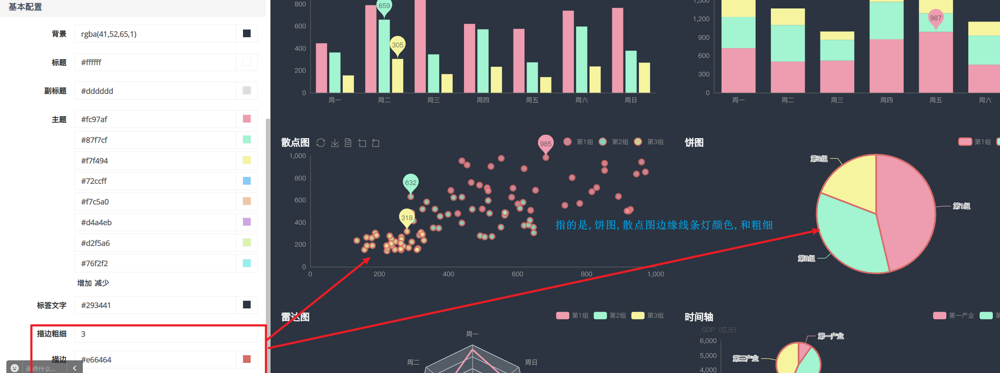
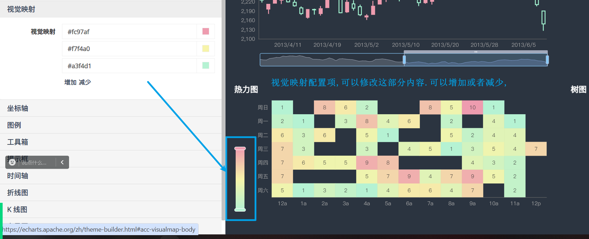
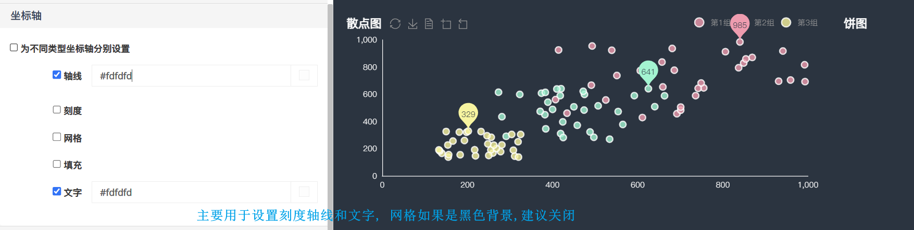
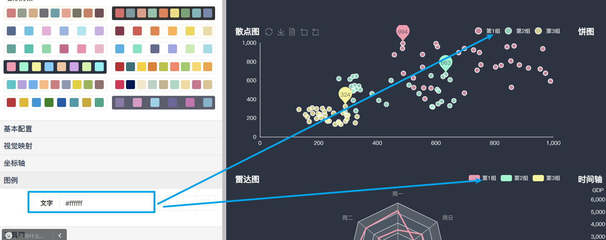
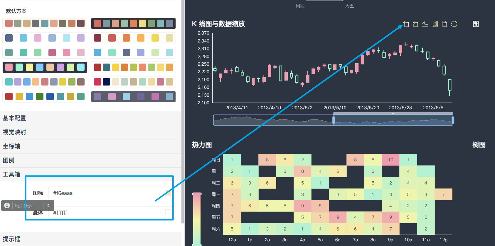
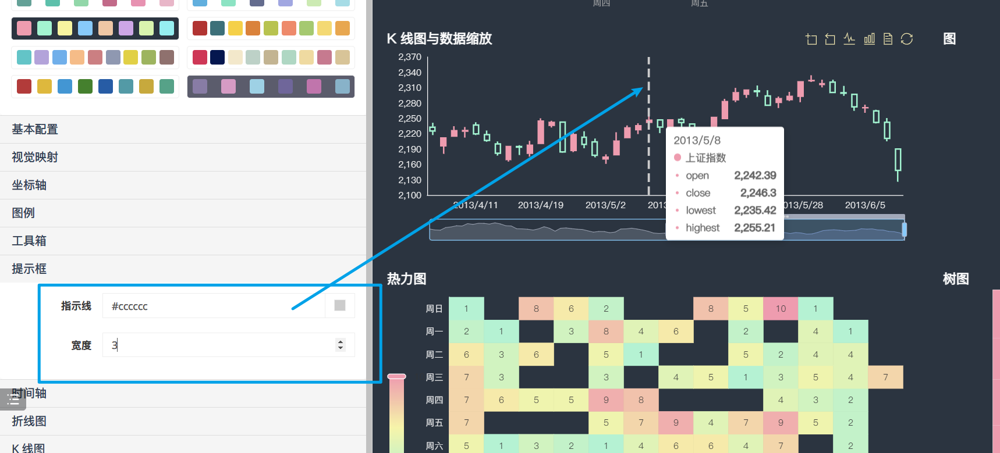
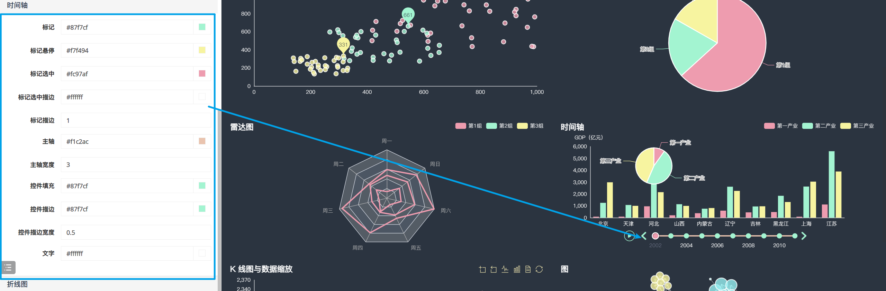
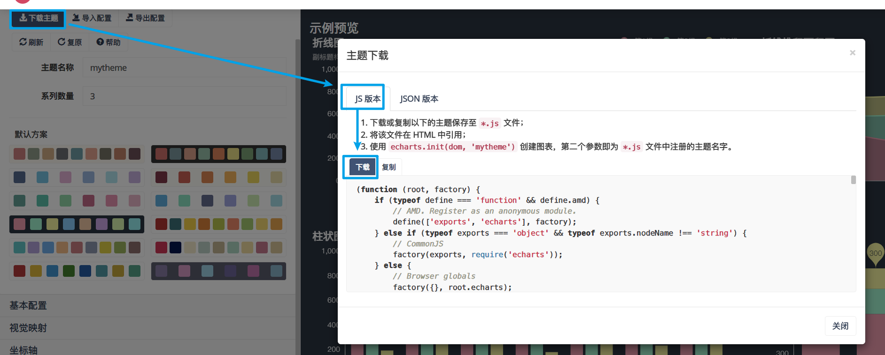
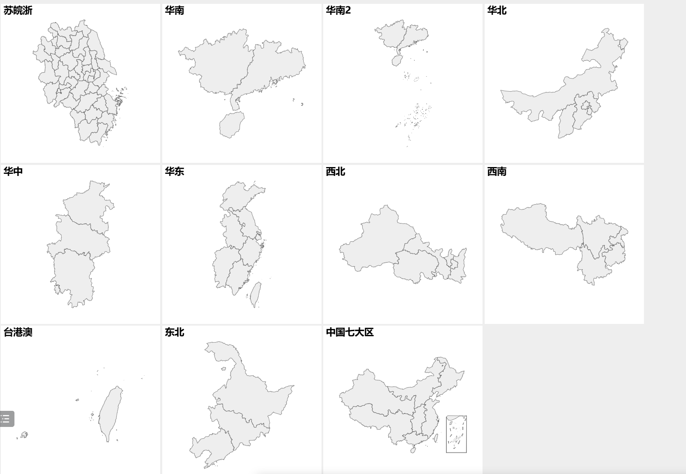
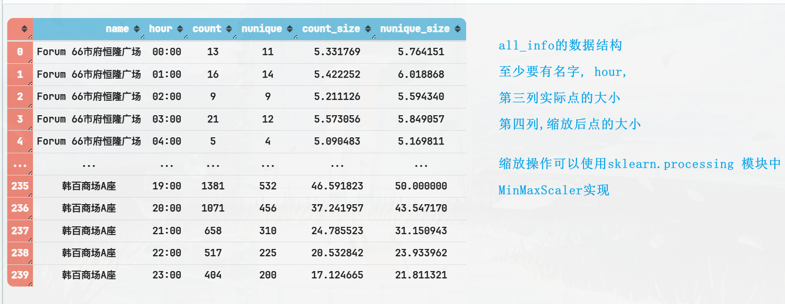

# Pyecharts篇

## 配置文档

1. 第一种通过关键字传参

2. 通过字典传参

   ```bar
   bar = Bar()
   bar.add_xaxis(["衬衫", "羊毛衫", "雪纺衫", "裤子", "高跟鞋", "袜子"])
   bar.add_yaxis("商家A", [5, 20, 36, 10, 75, 90])
   bar.add_yaxis("商家B", [15, 25, 16, 55, 48, 8])
   bar.set_global_opts(title_opts={"text": "主标题", "subtext": "副标题"})
   bar.render("bar.html")
   ```

> [!NOTE]
>
> 字典传参时,如何找到这些参数?

```python
class TitleOpts(BasicOpts):
    def __init__(
        self,
        is_show: bool = True,
        title: Optional[str] = None,
        title_link: Optional[str] = None,
        title_target: Optional[str] = "blank",
        subtitle: Optional[str] = None,
        subtitle_link: Optional[str] = None,
        subtitle_target: Optional[str] = "blank",
        pos_left: Optional[str] = None,
        pos_right: Optional[str] = None,
        pos_top: Optional[str] = None,
        pos_bottom: Optional[str] = None,
        padding: Union[Sequence, Numeric] = 5,
        item_gap: Numeric = 10,
        text_align: str = "auto",
        text_vertical_align: str = "auto",
        is_trigger_event: bool = False,
        title_textstyle_opts: Union[TextStyleOpts, dict, None] = None,
        subtitle_textstyle_opts: Union[TextStyleOpts, dict, None] = None,
    ):
        self.opts: Sequence = [
            {
                "show": is_show,
                "text": title,
                "link": title_link,
                "target": title_target,
                "subtext": subtitle,
                "sublink": subtitle_link,
                "subtarget": subtitle_target,
                "left": pos_left,
                "right": pos_right,
                "top": pos_top,
                "bottom": pos_bottom,
                "padding": padding,
                "itemGap": item_gap,
                "textAlign": text_align,
                "textVerticalAlign": text_vertical_align,
                "triggerEvent": is_trigger_event,
                "textStyle": title_textstyle_opts,
                "subtextStyle": subtitle_textstyle_opts,
            }
        ]
```

查看配置的源码,里面有关键词传参,还有就是用字典传参.


## 主题篇

可以使用Initopts初始化配置项,配置主题,width设定一般是100%, height=95vh, 设定bgcolor

> [!IMPORTANT]
>
> 自定义主题的使用.
>
> 主题编辑器: https://echarts.apache.org/zh/theme-builder.html


1. 可以使用echarts官网提供的主题配置工具

### 基本配置项



### 视觉映射配置




### 坐标轴配置



### 图例配置



主要是黑色背景下文字的样式.

### 工具箱配置



### 提示框



这里指的是线条灯颜色和粗细

### 时间轮播组件



###  折线图


### 主题的下载与使用



2. 重要: 将下载的主题,放到静态资源服务器的指定的目录下.`./pyecharts-assets-master/assets/themes`目录下

   根据官方文档的建议,应该放在,`./pyecharts-assets-master/assets/v5/themes`目录下,因此最好两者都放一下

```python
## 补充内容:
from pyecharts import options as opts
from pyecharts.charts import Bar
from pyecharts.faker import Faker
from pyecharts.globals import ThemeType
from pyecharts.globals import CurrentConfig
from pyecharts.datasets import register_url
register_url("http://127.0.0.1:8000/")
CurrentConfig.ONLINE_HOST = "http://127.0.0.1:8000/assets/"

from pyecharts.datasets import register_files
register_files({"mytheme": ["themes/mytheme", "js"]}) # 注册主题文件,需要注意点是,主题的名称最好和文件名一致.


c = (
    Bar(init_opts=opts.InitOpts(theme='mytheme'))
    .add_xaxis(Faker.choose())
    .add_yaxis("商家A", Faker.values())
    .add_yaxis("商家B", Faker.values())
    .set_global_opts(
        title_opts=opts.TitleOpts(title="Bar-Y 轴 formatter"),
        yaxis_opts=opts.AxisOpts(axislabel_opts=opts.LabelOpts(formatter="{value} /月")),
    )
)
c.render_notebook()
```

```python
# 通过图形的配置参数,可以实现一些特殊的效果.
c.options['xAxis'][0]['splitLine'] = False
c.render_notebook()
```

## 静态资源服务器

pyecharts 使用的所有静态资源文件存放于 [pyecharts-assets](https://github.com/pyecharts/pyecharts-assets) 项目中，默认挂载在 `https://assets.pyecharts.org/assets/`

或者可以在: https://github.com/pyecharts/pyecharts-assets 下载. 

下载之后,启动服务器,设定Host

### **Localhost-Server**

启动服务器

```
$ cd pyecharts-assets
$ python -m http.server
```

设置 host

```
# 只需要在顶部声明 CurrentConfig.ONLINE_HOST 即可
from pyecharts.globals import CurrentConfig

CurrentConfig.ONLINE_HOST = "http://127.0.0.1:8000/assets/"

# 接下来所有图形的静态资源文件都会来自刚启动的服务器
from pyecharts.charts import Bar
bar = Bar()
```

### 第三方地图文件

来自于地图工匠秘籍中的地图文件.



```
from pyecharts.datasets import register_url
register_url("http://127.0.0.1:8000/")
```

```python
from pyecharts.datasets import register_url
data_pair = [['华中',100]]
# 注册本地服务器的地图数据源
register_url("http://127.0.0.1:8000/")
from pyecharts.charts import Map
maps = (Map(init_opts=opts.InitOpts(theme=ThemeType.DARK,bg_color='#404a59'))
    .add(series_name='销量',data_pair=data_pair,maptype='中国七大区',
        is_map_symbol_show=False,  # 关闭地图上的点
        label_opts=opts.LabelOpts(is_show=False)
        )
       )
maps.render_notebook()
```

### 自定义地图-单个地图

对于来自于:GeoJson.io网站构建的地图,是可以直接添加绘制的,这里需要注意的是,比如先注册地图,才可以使用

```python
import json

with open('./地图资源/陕甘宁-黑吉辽.geojson','r', encoding='utf-8') as f:
    target_data = json.loads(f.read())
    

map=(Map()
    .add_js_funcs(f"echarts.registerMap('陕甘宁-黑吉辽', {target_data});")
    .add('山河四省',data_pair=[['陕西省',100]],maptype='陕甘宁-黑吉辽',is_map_symbol_show=False)
    .set_global_opts(visualmap_opts=opts.VisualMapOpts(max_=100000,min_=20000))
    )
map.render_notebook()
```

这里支持对地图进行自定义的增删改查.

> [!NOTE]
>
> .add_js_funcs(f"echarts.registerMap('陕甘宁-黑吉辽', {target_data});") # 如果注册地图文件是在geo进行的,那么绘图需要使用Geo进行绘制,若想使用Grid组件组合这些图表,则需要使用Grid组件重新注册地图.


### 自定义地图-多个地图融合

1. datav 阿里地图工具: https://datav.aliyun.com/portal/school/atlas/area_selector

```python
import os
def get_target_data(filepath, mapname = ''):
    target_data = """{
            "type": "FeatureCollection",
            "features": []}"""
    target_data = json.loads(target_data)
    list_region = os.listdir(filepath)
    name_list = []
    for lr in list_region:
        with open(f"{filepath}/{lr}", 'r', encoding='utf-8') as f:
            temp = json.load(f)
            temp = temp['features']
            for tp in temp:
                name = tp['properties']['name']
                # 将area加入tp节点并传入target_data
                tp['properties']['area'] = mapname
                target_data['features'].append(tp)
                name_list.append((name, np.random.randint(100, 5000)))
    return target_data
```

注意: 这里filepath是指目标地图文件存放的位置.

> [!WARNING]
>
> 问题: 地图轮廓如何进行删除?


## 地图可视化工具folium使用

### 问题1: 静态资源的替换

```python
def update_map(mapname='map.html'):
    """
    用于替换地图的静态资源文件
    mapname: 默认的地图文件名
    """
    import re
    with open(mapname,mode='r', encoding='utf-8') as f:
        html = f.read()

    css_partten = '|'.join(re.findall('(rel="stylesheet" href="https://.+/).*?.css"',html))
    html = re.sub(css_partten,r'rel="stylesheet" href="local/css/',html)
    js_partten = '|'.join(re.findall('(https://.+/).*?.js',html))
    html = re.sub(js_partten,r'local/js/',html)

    with open(mapname,mode='w',encoding='utf-8') as f:
        f.write(html)
    print('地图静态资源替换完成')
```

### 添加方向箭头

方法1: 通过plugins.PolyLineTextPath实现箭头绘制

方法2: 通过计算前后两点的坐标来实现箭头方向的计算

```python

# 飞机图例
from folium import plugins
map_center = [41.7010994,123.4920807]
maps =folium.Map(location=map_center,
    tiles=tiles,
    attr="高德-常规",
    zoom_start=12
                )

re = folium.PolyLine(
    [i[:2] for i in route],
    weight=3,
    color='green',
    opacity=0.6,
).add_to(maps)

# 警告图例
attr = {'fill': 'red'}
# 飞机图例
aircraft = {'font-weight': 'bold', 'font-size': '24'}

plugins.PolyLineTextPath(
    re,
    '   🏃‍➡️ ', # 图例样式,.可以使用unicode符号,💗  # \u2708  飞机  🏃‍➡️ ➡ ⬆
    repeat=True,
    offset=6,
    attributes=aircraft
).add_to(maps)
# #定义一个空列表将
use_location=[]
for i in range(len(location)):
    position_atitu = [location[i][0], location[i][1]]
    use_location.append([location[i][0], location[i][1]])
    if i < len(location) - 1:
        dx = location[i + 1][0] - location[i][0]  # dx
        dy = location[i + 1][1] - location[i][1]  # dy
        angle1 = math.atan2(dx, dy)
        angle2 = -int(angle1 * 180 / math.pi)
        mid_location = [location[i][0]+dx/2,location[i][1]+dy/2]
        #三角形图形指示方向，由于rotation的角度是顺时针旋转，
        folium.Marker(position_atitu, popup='<i>维度:</i>'+str(location[i][0])+'<br><i>经度:</i>'+str(location[i][1])+'<br><i>city_name:</i>').add_to(maps)

        folium.RegularPolygonMarker(mid_location, fill_color='black', number_of_sides=3, radius=5,
                                rotation=angle2).add_to(maps)
    else:
        folium.Marker(position_atitu, popup='<i>维度:</i>'+str(location[i][0])+'<br><i>经度:</i>'+str(location[i][1])+'<br><i>city_name:</i>').add_to(maps)
        
maps.save("test.html")
update_map('test.html')
```

## 序列号Pyecharts文件

这里可以使用pickle模块进行序列化和反序列化的操作.可以将pyecharts生成的文件,

```
with open('./test','wb') as f:
	f.write(pickle.dumps(maps)) # 这是序列化,图像对象
	f.write(pickle.dumps(maps.option)
```

序列化图像对象,后续使用过程中可以直接反序列化文件,然后直接渲染

序列化图像配置项, 后续使用过程中可以反序列化配置项,而且必须要先实例化一个图像对象,然后使用update方法更新配置项

## Streamlit模块

1. 基本的文本组件
2. 选择组件: 单选框,多选框….
3. 侧边栏: from streamlit_option_menu import option_menu 
4. 文件的上传和下载
5. 页面的布局: st.columns组件使用
6. html渲染: 在渲染Pyecharts时,使用: from streamlit.components.v1 import html 进行渲染
7. folium地图渲染时: from streamlit_folium import st_folium 进行渲染


## 可视化进阶图表

### 单轴散点图

需要注意的是数据的构建,通常情况我们将数据集命名为all_info是一个嵌套的列表,这里显示为dataframe.



核心绘图函数如下,这里比较关心的是数据集,和类目的数量,类目数量一般不建议超过7个.

```
def get_sca(allinfo, num=7): # allinfo是数据源, num是轴的数量,你有几个类目,这里就传几个,
    from pyecharts.charts import Scatter,Tab
    colors = ['#7c8bd1', '#a7d791', '#f8d47a', '#ee8786', '#95cce5', '#f99f76', 'violet','orange',
             '#7c8bd1', '#a7d791',]
    colors1 = ['#ff0000', '#3c7ef7', '#0000ff', '#ffff00', '#ff00ff', '#00ffff', '#ffffff','cyan',
              '#ff0000', '#3c7ef7',] # 这里的颜色,必须要大于轴的数量
    single_axis, titles = [], []     #  创建两个空列表,用于存放所有的轴,以及标题
    sca = Scatter() # 实例化一个散点图对象
    for idx, day in enumerate(list(set([i[0] for i in allinfo]))):       # 按天遍历数据
        sca.add_xaxis(xaxis_data=hours)  # 添加x轴
        single_axis.append({    # 设定每个轴的样式
            'left': '5%',        # 坐标轴距离坐标点位置
            'right': '53%',
            'bottom': '2%',
             'nameGap': 20,    # 坐标轴名称距离轴线的位置
            'nameLocation': 'start',   # 坐标轴名称的位置
            'type': 'category',     # 设定为分类数据
            'data': hours,         # 每个轴上面的x轴数据
            'top': f"{idx * 100 / num + 10}%",   # z坐标轴距离顶部的距离
            'height':f"{100 / num - 5}%",    # 坐标轴的高度
            'gridIndex':idx,      # 因为有多个轴,因此需要设定轴索引
            'axisLabel': {'interval':2, 'color':'cyan'}, # 轴标签的配置,设定间隔为2,颜色为红色
        })
        titles.append(dict(text=day,top=f'{idx * 100 / num + 5}%',left='0')) # 每个轴有一个标题,循环添加多个
        itemstyle = {
            'normal': {
                'color': JsCode(f"""new echarts.graphic.LinearGradient(0, 0, 1, 1, [
                  {{ offset: 0, color: '{colors[idx]}' }},
                  {{ offset: 1, color: '{colors1[idx]}' }}
                ],)"""),
                'barBorderRadius': [10,10,10,10],      #  柱子的四个角圆角设计
                'shadowColor':'rgba(108,80,243,0.9)', # 阴影的颜色
                'shadowBlur':5, # 阴影的宽度
            'shadowOffsetX': 2,
            'shadowOffsetY': 2,        
            'width':4,
            }
        }
        sca.add_yaxis('连接人数',   # 绘制y轴数据,设定seriesname为空
                     y_axis=[[int(item[2]),item[4]] for item in  allinfo if item[0] == day], # 设定y轴的数据
                     symbol_size=JsCode('function(x){console.log(x);return x[2] }'), # 设定点的大小,采用回调进行设置
                     label_opts=opts.LabelOpts(is_show=False), # 关闭点上面的数字
                      yaxis_index=0,itemstyle_opts=itemstyle                                        
                     )
        sca.add_yaxis('唯一人数',   # 绘制y轴数据,设定seriesname为空
                     y_axis=[[int(item[3]),item[5]] for item in  allinfo if item[0] == day], # 设定y轴的数据
                     symbol_size=JsCode('function(x){console.log(x);return x[2] }'), # 设定点的大小,采用回调进行设置
                     label_opts=opts.LabelOpts(is_show=False), # 关闭点上面的数字
                      yaxis_index=0,itemstyle_opts=itemstyle
                     )
        sca.options['series'][idx * 2]['singleAxisIndex'] =  idx  # 轴索引设置
        sca.options['series'][idx * 2 + 1]['singleAxisIndex'] =  idx  # 轴索引设置
        sca.options['series'][idx* 2]['coordinateSystem'] = 'singleAxis'  # 单轴设定
        sca.options['series'][idx* 2 + 1]['coordinateSystem'] = 'singleAxis'  # 单轴设定
    sca.options['singleAxis'] = single_axis  # 设定单轴
    sca.set_global_opts(
        xaxis_opts=opts.AxisOpts(is_show=False),
        yaxis_opts=opts.AxisOpts(is_show=False),
        title_opts = titles,
        legend_opts = opts.LegendOpts(is_show=True,selected_map={'Uv':False},
                selected_mode='single',pos_left='0%',legend_icon='roundRect')
    )
    return sca
sca.render()
```

### Grid组件组合图表

1. 组合图表时必须要先组合直角坐标系图表,然后才是非直角坐标系图表,
2. 大多数非直角坐标图图表,位置参数都可以通过自身参数进行调节.
3. 补充: 选项卡组图Tab组件,不能组合Page

## 常见图表样式配置


